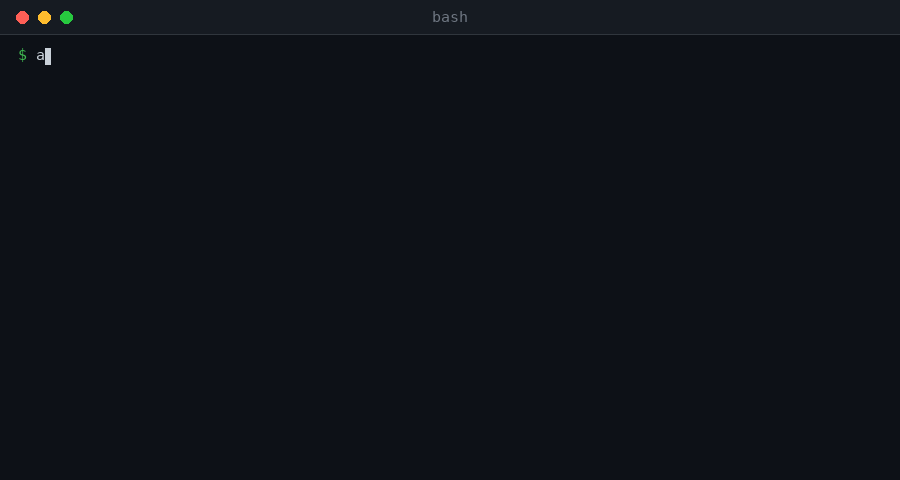

# ai-terminal



Natural-language-to-shell-command generator powered by [Ollama](https://ollama.com) and small local LLMs.

Describe what you want to do in plain English (or any language), and `ai` turns it into a shell command you can review, copy, or run — nothing is executed automatically.

```bash
$ ai "show the 10 processes using the most memory"

[LLM: terminal (default · Qwen-0.5B-Coder-El-Terminalo)]

ps aux --sort=-%mem | head -n 11

[e] run  [c] copy  [q/Enter] cancel:
```

## Features

- **Fully local** — runs entirely through Ollama, no API keys, no data leaves your machine.
- **Multiple models, one command** — pick the model that best fits your prompt via a flag, no need to change environment variables by hand.
- **Review before you run** — every generated command is shown first; you choose to execute (`e`), copy to the clipboard (`c`), or cancel (`q` / Enter).
- **Shows which LLM answered** — every response prints the model that generated it, so you always know which one produced a given command.
- **Cross-platform installer** — one script sets up Ollama, the systemd service (or LaunchAgent on macOS), the models, and the `ai` shell function.

## Models

The installer downloads and registers four small GGUF models in Ollama. Each one is exposed through a flag on the `ai` command:

| Flag | Purpose            | Model                                          | Ollama name (default)   |
|------|--------------------|-------------------------------------------------|--------------------------|
| _(none)_ | Default            | Qwen-0.5B-Coder-El-Terminalo (Q8)              | `terminal`               |
| `-d` | Developer          | Qwen2.5-Coder-0.5B-Instruct (Q4_K_M)           | `terminal-dev`           |
| `-g` | Generalist         | meta-llama/Llama-3.2-1B-Instruct (Q4_K_M)      | `terminal-gen`           |
| `-f` | Function-calling   | FunctionGemma 270M (Q4_K_M)                    | `terminal-fn`            |

All models are small enough to run comfortably on CPU-only machines, laptops, and low-resource environments (the generalist model is the largest, at ~800 MB).

## Requirements

- Linux (Ubuntu, Debian, Fedora, CentOS/RHEL/Rocky/AlmaLinux, Arch/Omarchy/Manjaro/EndeavourOS), WSL, or macOS.
- `curl`.
- `bash` or `zsh`.
- `sudo` (used automatically when not running as root; installs system dependencies and configures the systemd service).
- Internet access to download the models from Hugging Face (roughly 2–2.5 GB in total, across the four models).

## Installation

### Quick install

Downloads the installer script and runs it directly, without cloning the repository:

```bash
curl -fsSL https://raw.githubusercontent.com/Giuliano-sn/ai-terminal/main/install-terminal-ai.sh | bash
```

### Manual install

```bash
git clone <this-repo-url>
cd ai-terminal
chmod +x install-terminal-ai.sh
./install-terminal-ai.sh
```

The installer will:

1. Install OS-level dependencies (`curl`, CA certificates).
2. Install Ollama if it isn't already present.
3. Configure the Ollama service (systemd on Linux, a WSL boot command, or a LaunchAgent on macOS).
4. Wait for the Ollama server to come up.
5. Download all four GGUF models to `~/.local/share/terminal-ai` and register them in Ollama (`ollama create`).
6. Create the per-model harness files under `~/.local/share/terminal-ai/harness` (skipped if they already exist).
7. Install the `ai` executable to `~/.local/bin/ai`.
8. Add a `PATH` entry, environment variables, and an `ai()` shell function to `~/.bashrc` or `~/.zshrc`.
9. Run a smoke test against each registered model.

After installation, open a new terminal or reload your shell configuration:

```bash
source ~/.bashrc   # or source ~/.zshrc
```

### Uninstall

```bash
./install-terminal-ai.sh --remove
```

This removes everything the installer created:

1. The four registered models (`ollama rm`).
2. The `~/.local/share/terminal-ai` directory (GGUF files, Modelfiles, and harness files).
3. The `~/.local/bin/ai` executable.
4. The managed block in `~/.bashrc` and `~/.zshrc`.

Ollama itself is left installed, since it may be used by other applications — the command prints the steps to remove it too, if you want to.

### Optional environment variables (installer)

Set these before running the installer to customize install locations or the base model name:

| Variable       | Default                          | Description                                   |
|----------------|-----------------------------------|------------------------------------------------|
| `MODEL_NAME`   | `terminal`                        | Base name used for all four registered models (`terminal`, `terminal-dev`, `terminal-gen`, `terminal-fn`). |
| `INSTALL_DIR`  | `$HOME/.local/share/terminal-ai`  | Where GGUF files and Modelfiles are stored.    |

```bash
MODEL_NAME=myai INSTALL_DIR="$HOME/.local/share/myai" ./install-terminal-ai.sh
```

## Usage

```bash
ai "<description of what you want to do>"
ai -d "<description>"   # use the developer model (Qwen2.5-Coder-0.5B-Instruct)
ai -g "<description>"   # use the generalist model (Llama-3.2-1B-Instruct)
ai -f "<description>"   # use the function-calling model (FunctionGemma 270M)
ai -H [-d|-g|-f]         # edit that model's harness file in $EDITOR/$VISUAL
```

Quotes are optional — `ai list running docker containers` works the same as `ai "list running docker containers"`.

### Examples

```bash
ai "show the 10 processes using the most memory"
ai "list running docker containers"
ai -d "write a python function that sorts a list"
ai -g "explain what an IP address is"
ai -f "find files larger than 1 GB in /var"
```

After a command is generated, you're prompted for an action:

- `e` — execute the command in your current shell (not offered with `-g`, since the generalist model answers in plain text instead of generating a command).
- `c` — copy the command to the clipboard (`wl-copy`, `xclip`, `xsel`, `pbcopy`, or `clip.exe`, whichever is available).
- `q` or **Enter** — cancel, do nothing.

Every response prints which LLM produced it, e.g. `[LLM: terminal-dev (developer · Qwen2.5-Coder-0.5B-Instruct)]`, so you always know which model answered — no flag prints the default model, and each flag prints its corresponding model.

### Runtime environment variables

These are exported by the installer into your shell rc file and can be overridden per-session:

| Variable                | Used by | Default        |
|--------------------------|---------|----------------|
| `TERMINAL_AI_MODEL`      | default | `terminal`     |
| `TERMINAL_AI_MODEL_DEV`  | `-d`    | `terminal-dev` |
| `TERMINAL_AI_MODEL_GEN`  | `-g`    | `terminal-gen` |
| `TERMINAL_AI_MODEL_FN`   | `-f`    | `terminal-fn`  |
| `TERMINAL_AI_HARNESS_DIR`| harness folder | `~/.local/share/terminal-ai/harness` |

## Harness (custom instructions)

Each model has its own small, plain-text **harness file** — extra instructions that get appended to every prompt sent to that model, on top of the OS/shell/directory context and the language directive `ai` already adds automatically.

| File           | Used by |
|----------------|---------|
| `default.txt`  | default model |
| `developer.txt`| `-d` |
| `generalist.txt`| `-g` |
| `function.txt` | `-f` |

They live in `~/.local/share/terminal-ai/harness/` (or `$TERMINAL_AI_HARNESS_DIR` if set) and are created with sensible starter content on install — they are never overwritten on a reinstall, so your edits are safe.

Rules:
- Lines starting with `#` are treated as comments and ignored.
- Every other line is appended, in order, to the end of the prompt (after the request), so keep instructions short and specific — e.g. "Never use `sudo`." or "Prefer `awk` over `sed` for column extraction."

Edit a harness file with the built-in flag. On [Omarchy](https://omarchy.org/) it opens through `omarchy launch editor` (your configured default editor); elsewhere it opens `$VISUAL`, falling back to `$EDITOR`, falling back to `vi`:

```bash
ai -H         # edit the default model's harness
ai -H -d      # edit the developer model's harness
ai -H -g      # edit the generalist model's harness
ai -H -f      # edit the function-calling model's harness
```

Or edit the files directly — they're plain text:

```bash
"${EDITOR:-vi}" ~/.local/share/terminal-ai/harness/generalist.txt
```

## Safety

`ai` never runs the generated command on its own. You always see the command first and must explicitly choose `e` to execute it.
